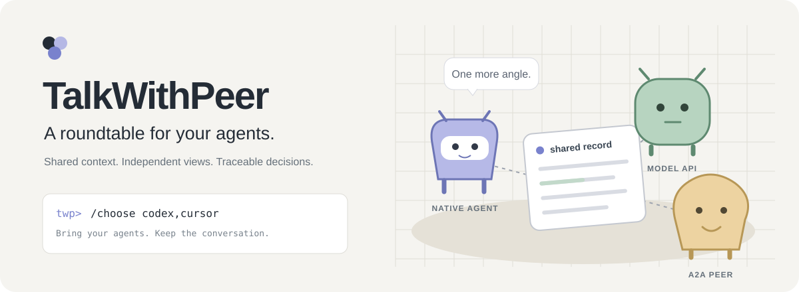
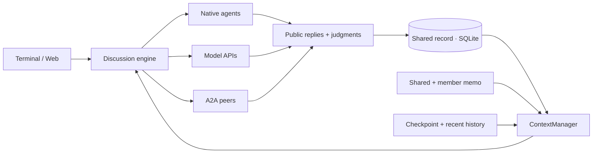

<div align="center">

# TalkWithPeer

**给你的 Agent 开一场有记录的圆桌会。**

`CLI + Web` · `Native Agents + Model APIs` · `Platform-owned Context`

[快速开始](#快速开始) · [接入方式](#给圆桌搬几把椅子) · [上下文设计](docs/context-design.md) · [命令手册](docs/usage.md#slash-commands) · [参与开发](#一起把圆桌做得更好)

</div>

Codex 提一个方案，Cursor 补一个角度，DeepSeek 保留一处不同意见。TalkWithPeer 给它们同一份公开记录、各自独立的 memo，以及一份能回看每个判断的讨论结果。

你可以在终端里开会，也可以在网页上点开每位成员的小 pet，查看它的公开解释和运行过程。

## 圆桌上有什么

| 能力               | 你会得到什么                                                              |
| ------------------ | ------------------------------------------------------------------------- |
| 多种参与者         | 本机 Codex / Cursor / Reasonix、直接模型 API、标准 A2A Agent 可以同场讨论 |
| 每句话有出处       | 回复显示 Agent、实际模型和讨论轮次，公开记录持久化                        |
| 平台自己的上下文   | 共享 memo、成员 memo、checkpoint 与近期记录由平台构建                     |
| 可以说“我不同意”   | 全体接受同一候选才算共识；双向明确不可让步的冲突可形成分歧终局            |
| 终端和网页一起用   | 会话、项目、模型与参数共用同一份 SQLite 数据                              |
| 一位成员，一只 pet | 导入本机 Codex pets 或安装链接，点击查看该成员的公开过程                  |

共识说明成员接受了同一个候选，**不证明它们的结论一定正确**。没有完成的判断会暂停，错误和超时不会被算作投票。

## 快速开始

需要 **Node.js 22.13+**。选择原生 Agent 时还需要对应 CLI 已安装并完成登录；直接 API 不需要安装原生 Agent。

```bash
git clone https://github.com/God1007/TalkWithPeer.git
cd TalkWithPeer
npm install
npm run cli
```

接下来在终端输入：

```text
/choose codex,cursor
/memo add 方案必须保留未解决的分歧
帮我讨论一个多 Agent 共享记忆方案。
```

`/choose` 不带参数会列出实际可用连接；模型来自本机运行时或 API 的发现接口。没有安装 Codex/Cursor 时，可以先添加 API，再选择连接。

<details>
<summary><b>我想先用模型 API</b></summary>

在启动服务前设置对应环境变量（例如 `DEEPSEEK_API_KEY`），然后：

```text
/connect deepseek
/choose
```

也支持 `/connect openai`、`/connect anthropic` 和自定义兼容 API。网页可以直接填写 API Key，具体地址、协议和凭证说明见[使用手册](docs/usage.md#直接模型-api)。

</details>

<details>
<summary><b>我想打开网页和 pets</b></summary>

```bash
npm run build
npm start
```

打开 [http://127.0.0.1:48273/](http://127.0.0.1:48273/)。在 **设置 → 添加 API / Agent 连接** 创建连接，在 **添加参与者** 中选择模型。

双击 macOS 的 `TalkWithPeer.command` 也可启动。终端会连接已有服务，网页和终端可以继续同一场讨论。

</details>

<details>
<summary><b>我想在任意目录输入 twp</b></summary>

```bash
npm link
twp
```

`twp` 没有发现本机服务时自动启动。退出自建服务的终端会暂停讨论并停止服务；连接已有服务时，退出只断开终端。

</details>

## 给圆桌搬几把椅子

| 参与者         | 接入方式              | 接入状态                                           |
| -------------- | --------------------- | -------------------------------------------------- |
| Codex          | app-server            | 真实调用与讨论已验证                               |
| Cursor         | Headless CLI          | 真实调用与讨论已验证                               |
| Reasonix       | ACP                   | 真实调用与讨论已验证                               |
| DeepSeek API   | Chat Completions      | 真实调用、原生混合讨论与压缩后继续已验证           |
| OpenAI API     | Responses             | 已实现，协议测试通过；尚未使用真实 API Key 验证    |
| Anthropic API  | Messages              | 已实现，协议测试通过；尚未使用真实 API Key 验证    |
| 自定义模型 API | 三种兼容协议          | 支持基础地址与 Key/环境变量；需要模型发现接口      |
| A2A Agent      | Agent Card + 官方 SDK | v1 / v0.3 协议测试通过；远程实际行为取决于该 Agent |

原生 Agent 接入保留其单次运行能力；直接 API 接入由平台提供上下文。模型可以一起讨论，具体执行能力仍有所不同：API 不会因为收到项目路径就获得本机文件访问。

接口说明见 [Agent adapter interface](docs/agent-interface.md)。

## 上下文是这张桌子的核心



平台保留完整记录，每个阶段固定公开快照，再给各成员构建输入。超出平台预算时，可把早期轮次压缩成带来源的 checkpoint，当前用户轮次仍完整保留。

**已经做了：** 快照版本、成员 memo 隔离、稳定平台会话、历史 checkpoint、自动/手动压缩、失败不覆盖原记录。

**还没有解决：** 摘要语义漂移、按模型窗口扣除输出/推理预算、当前轮次持续增长、完整请求投影审计、长对话防漂移评测。预算目前是字节启发式估算，来源 ID 校验也不等于摘要保真。

我们把这些问题和实现优先级写进了[上下文设计](docs/context-design.md)，方便按可测量的问题推进。

## 几个你会常用的命令

| 命令                                        | 用途                               |
| ------------------------------------------- | ---------------------------------- |
| `/choose`                                   | 选参与者                           |
| `/models 1` / `/model 1 <模型ID>`           | 查看与切换实际模型                 |
| `/project <路径>` / `/read <相对文件>`      | 选择项目并明确分享材料             |
| `/memo add <内容>` / `/memo agent 2 <内容>` | 设置共享或成员 memo                |
| `/context full` / `/compact 1`              | 查看本次上下文、选择压缩模型       |
| `/show trace` / `/focus 2`                  | 看公开过程，聚焦某位成员的实时发言 |
| `/hide messages` / `/history`               | 调整显示，随时重读记录             |
| `/stop` / `/resume`                         | 暂停与继续                         |

全部命令、会话切换、参数和连接示例见[命令手册](docs/usage.md#slash-commands)。显示筛选不会删消息或改变 Agent 收到的内容。未公开的内部思维不会被复制或伪造。

## 一起把圆桌做得更好

当前最欢迎的贡献围绕 **上下文可靠性**：

- [ ] 固定任务约束与结构化消息身份。
- [ ] 每位成员的窗口、输出和推理预算。
- [ ] 保留约束与分歧的结构化 checkpoint。
- [ ] 当前轮次的结构化状态与历史证据回取。
- [ ] 请求 manifest、长对话与重复压缩评测。

这些是计划，不是已交付功能。更细的顺序与验收方向见[设计文档](docs/context-design.md#建议实现顺序)。

从具体场景开始会更有帮助：在哪一轮遗忘了哪条约束、用了什么模型、压缩前后有哪些来源。请在 [Issues](https://github.com/God1007/TalkWithPeer/issues) 提供经过脱敏的复现信息，或通过 Pull Request 贡献一个小而可验证的改动。

本地检查：

```bash
npm test
npm run build
```

当前 **23 项自动检查通过**。覆盖状态恢复、上下文投影、memo 隔离、checkpoint、预算超限、API、A2A、密钥处理与结果判断；这不等于已经通过长对话语义稳定性评测。

| 想了解什么                   | 去哪里                                       |
| ---------------------------- | -------------------------------------------- |
| 怎么运行、怎么配置、全部命令 | [使用手册](docs/usage.md)                    |
| 已有上下文方案和下一步       | [上下文设计](docs/context-design.md)         |
| 核心职责和数据流             | [架构决定](docs/architecture.md)             |
| 怎么接入一种新的 Agent       | [Adapter interface](docs/agent-interface.md) |
| 哪些真实验证已经完成         | [实现进度](docs/progress.md)                 |

## 运行边界

本机单用户，数据默认位于 Git 忽略的 `.talkwithpeer/`。设置 `TWP_DATA_DIR` 或 `TWP_PORT` 可修改目录和端口。项目材料发送给哪些模型由你选定的连接和共享操作决定。

手动输入的 API Key 保存在本机权限 `600` 的明文凭证文件，不随连接配置返回网页，尚未接入系统钥匙串。原生账户凭证仍由原生工具管理。

原生运行时的单轮工具循环和内部压缩仍由它们负责；本平台没有统一任意 shell 执行、向量库、多用户 ACL 或自定义职责系统。远程 pet 安装链接已实现，但尚未做真实端到端导入验证。

## 致谢与许可

上下文设计借鉴 [Pi compaction](https://github.com/earendil-works/pi/blob/main/packages/coding-agent/docs/compaction.md) 的 checkpoint 思路，并参考 [DeepSeek Harness](https://github.com/deepseek-ai/deepseek-harness) 的 compaction 分工。第三方 Agent 使用 [A2A](https://a2a-protocol.org/latest/specification/) 协议互通。

仓库的开源许可证尚待维护者确定；当前公开源码不应被描述为已经提供某个许可授权。README 横幅为本项目原创 SVG 插画，未包含用户导入的个人 pet 素材。
